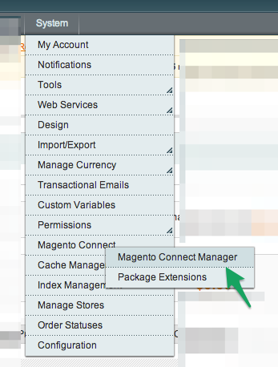
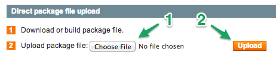

[](https://affirm.com) 

**Compatible with**

Magento CE 1.4.0.1+

Install
-------

####Install via FTP

1. Click here to download the latest package release (.tgz): https://github.com/Affirm/Magento_Affirm/releases/latest
2. Extract the contents of the package to your computer
3. Upload the package contents to your Magento root directory


####To install using from a package (Magento Connect Manager):

1. Click here to download the latest package release (.tgz): https://github.com/Affirm/Magento_Affirm/releases/latest
2. Visit System > Magento Conenct > Magento Connect Manager
3. Upload the Magento_Affirm package

[](https://affirm.com) 
[](https://affirm.com) 

####Install via SSH


####To install using [modgit](https://github.com/jreinke/modgit)

```
cd MAGENTO_ROOT
modgit init
modgit -i extension/:. add Magento_Affirm https://github.com/Affirm/Magento_Affirm.git
```
to update:
```
modgit update Magento_Affirm
```

####To install using [modman](https://github.com/colinmollenhour/modman)

```
cd MAGENTO_ROOT
modman clone https://github.com/Affirm/Magento_Affirm.git
```
to update:
```
modman update Magento_Affirm
```


####To install user [magento-composer-installer](https://github.com/Cotya/magento-composer-installer)

```
composer require affirm/affirm-php
```

####To install using Affirm's deploy script

1. Download the [Makefile](https://raw.githubusercontent.com/Affirm/Magento_Affirm/master/util/Makefile) (requires git, wget)
2. Copy to MAGENTO_ROOT
3. To install, run `make install`
4. To update, run `make update`
 
####Known Issue with SSH installation
If you are upgrading from 2.x to 3.x version of the extension via SSH, double promo banners may be displayed. 
To fix the issue, remove the following to from the Magento directory:
```
MAGENTO_ROOT/app/code/community/Affirm/Affirm/Model: Pricer.php
MAGENTO_ROOT/app/code/community/Affirm: AffirmPromo
MAGENTO_ROOT/app/design/frontend/base/default/template: affirmpromo
MAGENTO_ROOT/app/etc/modules: Affirm_AffirmPromo.xml
MAGENTO_ROOT/lib: Affirm
```
 
 

Configure
---------

**Payment Method**

1. Log in to your Magento Admin portal.
2. Visit System > Cache Management. Then, click _Flush Magento Cache_
2. Visit System > Configuration > Sales > Payment Methods > Affirm
3. Set the API URL. In a test environment, use ```https://sandbox.affirm.com```. On your live site, use ```https://api.affirm.com```.
4. Provide your 3 keys (merchant API key, secret key, financial product key)
5. Adjust the order total minimum and maximum options to control when Affirm is
   shown to your customers.
 
	

**Promos**

1. Visit System > Configuration > Affirm Promos (under General)
2. Set the Promo Key and enable the extension.
3. (optional) Customize the size and position of your promos.
	
	

Developers
----------

Read the [Developer README](DEVELOPER-README.md)
