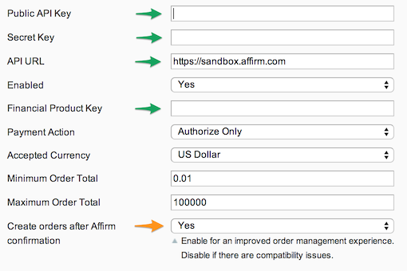

[](https://affirm.com) 

**Compatible with**

Magento CE 1.4.0.1+

Install
-------

####To install using [modgit](https://github.com/jreinke/modgit)

```
cd MAGENTO_ROOT
modgit init
modgit -i extension/:. add Magento_Affirm https://github.com/Affirm/Magento_Affirm.git
```
to update:
```
modgit update Magento_Affirm
```

####To install using [modman](https://github.com/colinmollenhour/modman)

```
cd MAGENTO_ROOT
modman clone https://github.com/Affirm/Magento_Affirm.git
```
to update:
```
modman update Magento_Affirm
```

####To install using from a package (Magento Connect Manager):

1. Click here to download the latest package release (.tgz): https://github.com/Affirm/Magento_Affirm/releases/latest
1. Visit System > Magento Conenct > Magento Connect Manager
1. Upload the Magento_Affirm package

[](https://affirm.com) 
[](https://affirm.com) 

####To install using Affirm's deploy script

1. Download the [Makefile](https://raw.githubusercontent.com/Affirm/Magento_Affirm/master/util/Makefile) (requires git, wget)
2. Copy to MAGENTO_ROOT
3. To install, run `make install`
4. To update, run `make update`

Configure
---------

**Payment Method**

1. Log in to your Magento Admin portal.
2. Visit System > Cache Management. Then, click _Flush Magento Cache_
2. Visit System > Configuration > Payment Methods (under Sales) > Affirm
3. Set the API URL. In a test environment, use ```https://sandbox.affirm.com```. On your live site, use ```https://api.affirm.com```.
4. Provide your 3 keys (merchant API key, secret key, financial product key)
5. Adjust the order total minimum and maximum options to control when Affirm is
   shown to your customers.
 
	

**Promos**

1. Visit System > Configuration > Affirm Promos (under General)
1. Set the Promo Key and enable the extension.
1. (optional) Customize the size and position of your promos.
	
	

Developers
----------

Read the [Developer README](DEVELOPER-README.md)
